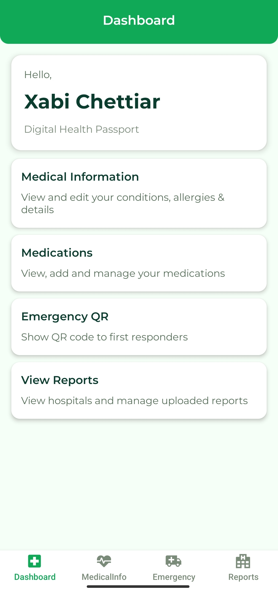
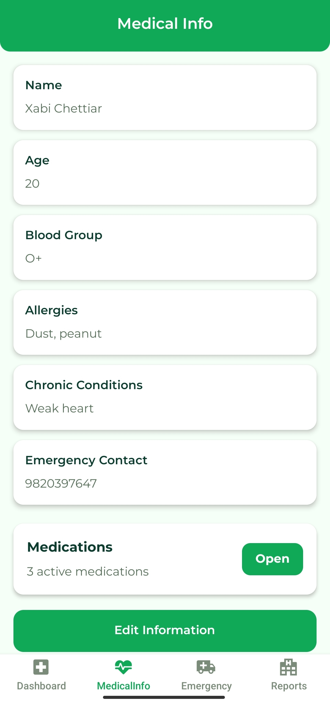

# Digital Health Passport

Digital Health Passport is a mobile application built using React Native, Expo, and Supabase for securely storing and managing personal medical information.

---

## Features

- User Authentication
- Medical Information Storage
- Profile Management
- Emergency Contact Information
- Persistent User Sessions
- Clean Mobile UI

---

## Tech Stack

- React Native
- Expo
- Supabase
- React Navigation

---

## Installation

```bash
npm install
npx expo start
```

Create a `.env` file with your Supabase credentials.

---

## Screenshots

<p align="center">
  
  
  
</p>
## Author

Developed by XabiChettiar
